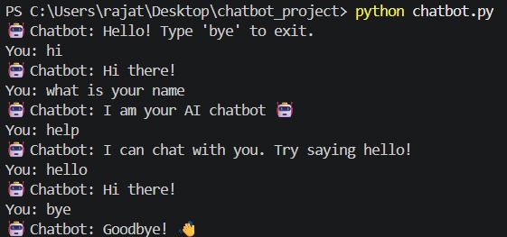

# 🤖 Chatbot Project

⭐ Internship Project - Decode Labs

This project is a simple chatbot built using Python as part of my internship at Decode Labs.
The chatbot can interact with users and respond to basic queries using predefined logic.

---

## 🚀 Features

* Interactive command-line chatbot
* Handles basic user inputs
* Simple and clean logic implementation
* Easy to understand and modify

---

## 🛠️ Tech Stack

* Python
* Git & GitHub

---

## 📂 Project Structure

```
DecodeLabs-Internship/
│── chatbot.py
│── output.png
│── README.md
```

---

## ▶️ How to Run

1. Clone the repository:

```
git clone https://github.com/kaushik4491-byte/DecodeLabs-Internship.git
```

2. Navigate to the project folder:

```
cd DecodeLabs-Internship
```

3. Run the chatbot:

```
python chatbot.py
```

---

## 📸 Example Output



---

## 🔮 Future Improvements

* Add GUI (Tkinter or Web Interface)
* Improve chatbot intelligence using AI
* Integrate APIs for real-time responses

---

## 👤 Author

Rajat
